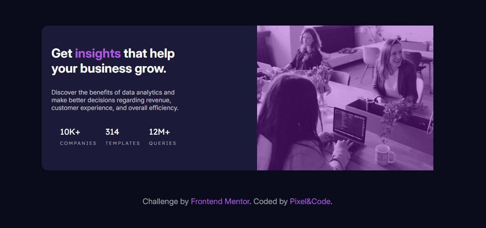

## Table of contents

- [Overview](#overview)
  - [The challenge](#the-challenge)
  - [Screenshot](#screenshot)
  - [Links](#links)
- [My process](#my-process)
  - [Built with](#built-with)
  - [What I learned](#what-i-learned)
  - [Continued development](#continued-development)
  - [Useful resources](#useful-resources)
- [Author](#author)
- [Acknowledgments](#acknowledgments)


## Overview

You built a Stats preview card component that displays marketing insights for a business. The design highlights analytics data (like number of companies, templates, queries) alongside a beautiful header image with a purple overlay effect.

This component is fully responsive and visually engaging, making it perfect for showcasing on a portfolio.

### The challenge

The biggest challenge was creating a colored overlay on top of the image while keeping the image fully visible and responsive.

Learning to properly position the overlay without breaking the layout or blocking content.

Managing the flex layout to ensure the image and text align well on both desktop and mobile views.

### Screenshot




### Links

- Solution URL: [Add solution URL here](https://github.com/jeff20501/insight-stats-card)
- Live Site URL: [Add live site URL here](https://insight-stats-card.netlify.app/)

## My process
1️⃣ Design layout: You started by building the basic HTML structure using semantic tags and flexbox for layout.

2️⃣ Add image with responsiveness: You used a ```<picture>``` element to support different images on mobile and desktop.

3️⃣ Overlay implementation: You experimented with CSS techniques to create an overlay. Finally, you solved it by adding a dedicated .overlay div positioned absolutely over the image.

4️⃣ Styling and fine-tuning: You customized fonts, colors, and spacing to match the design, then added responsive adjustments.

5️⃣ Test and refine: You verified the component on different screen sizes to ensure it looks great everywhere.

### Built with

- HTML

- CSS (Flexbox, overlays, media queries)

- Responsive images with <picture>

### What I learned

- How to create a CSS overlay using an absolutely positioned div.

- How to use ```<picture>``` for responsive images.

- The importance of checking stacking context and position: relative on parent containers when layering elements.

- Flexbox tricks for aligning and spacing content.

- How to handle media queries for responsive design.


To see how you can add code snippets, see below:

```html
<h1>Some HTML code I'm proud of</h1>
```
```css
.proud-of-this-css {
  color: papayawhip;
}
```
```js
const proudOfThisFunc = () => {
  console.log('🎉')
}
```


### Useful resources

- [w3schools:](https://www.w3schools.com/howto/howto_css_overlay.asp) How TO - Overlay for overlay techniques.

- [Kevin Powell's video](https://www.youtube.com/watch?v=NwnZU6mWJkk) for learning about adding an overlay to a background image.

## Author

- Frontend Mentor - [@jeff20501](https://www.frontendmentor.io/profile/jeff20501)
- github - [@jeff20501](https://github.com/jeff20501)

## Acknowledgments

- w3schools: How TO - Overlay for overlay techniques.

- Kevin Powell's video for learning about adding an overlay to a background image.
